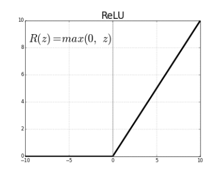

# 4월 28일 수업 요약
### Created Apr. 30. 2022. by B. InSung
---
## Machine Learning

- 회기분석
    - 지도 학습
        - X 라는 입력 값과 Y 라는 입력값을 모델에게 알려주고 이를 기준으로 데이터의 라벨을 분류함.

    - 지도학습의 예시 모델
        - KNN
            - 분류학습, 회기
        - Naive Bayes
            - 확률 분포를 활용
            - P(A|B) : 사건 B 발생 시, 사건 A가 발생할 경우
            - *추가조사*
                > RBM 모델 같은 경우 Binary한 확률 분포를 활용한다. 기초적인 인공지능의 모델로 구성이 되어 있으며 더 자세한 내용은 본인이 찾아보길 :D
        - SVM
            - 그래프 상에서 같은 부류의 데이터 2개를 찾아 일직선을 긋음. 다음으로 같은 부류의 데이터를 또 찾아 일직선을 긋고 이를 반복하며 여러 일직선들을 곡선으로 만들어 분류화 시킴.
            - 2차원적인 데이터 상에서 안되는 경우 차원을 늘려서 해결이 가능.
            

    - 비지도학습
        - 지도 학습과는 달리 X, Y 구분을 주지 않아 스스로 분류를 해 나가는 방식.
    
    - 비지도학습의 예시 모델
        - Clastering
            - 데이터의 분포 형태를 보고 집단을 분류하는 방식
            
        - K-Means
            - 기준이 되는 점의 갯수를 K 값으로 정함. (단, K는 Scalar). 예를 들어 K = 3 이라고 한다면 랜덤하게 3개의 점을 찍음. 주변 점들과의 평균을 구하고 비슷한 데이터를 기준점으로 끌어당겨 분류화를 시킨다.
            

- 강화 학습
    - 데이터 하나만 던져주고 보상을 얻어가며 스스로 예측하는 방식.
    - 비지도 학습과는 다르게 __보상__ 이라는 개념이 존재.
        - *추가조사*
        > 현재의 __상태__ 에서 모델이 어떤 __행동__ 을 취하는지에 대해 최적의 결과 값을 내는 것이 주 목표. 여기서 보상은 어떤 행동이 맞고 틀리고를 알려준다고 생각하면 된다. 
        >> 즉, 옳은 행동을 하거나 득이 되는 결과를 도출 했을 경우에는 보상이 주어짐으로써 맞다는 판단을 옳게 만들고 옳지 않거나 득이 되지 않는 결과를 냈을때는 보상이 없기에 잘못 되었음을 인지하게 되는 방식을 얘기한다.

## Deep Learning
- 딥러닝은 뇌의 구조와도 같아 전달이 많아질수록 세포수가 늘어남을 모방하여 만들어진 구조이다. 입력이 곳, 자극이 되며 이 자극으로 세포의 결정으로 다음 세포에게 전기적 신호를 전달. 게속 자극과 시도 전달로 이루어짐. 
    - 모델에서는 Visible Layer, Hidden Layer, Output Layer와 같이 나뉘어 Visible Layer에서 입력을 받고 Hidden Layer을 통과하여 Output Layer로 결과를 뱉어낸다. 
    

    - 퍼셉트론 
    - Activation Function (활성함수)
        - Step Function (단위 계단 함수)
            - Binaural 하게 0과 1로 나뉘어서 극단적으로 값을 전해준다고 생각하면 된다. 모델이 확률적인 계산을 할 때 확실한 연산과정과 프로세싱을 사용된다. 
            - 문제는 너무 극단적으로 가다보니 실제 값과 Step Function을 통해 나온 값이 확연히 다를 수 있다는 것 이다. 비유를 통해 말하면 컵 2개로 야바위를 하던 도중 매번 잘 나오다가 한번 틀리면 계속 틀리게 되는 것 이다.
            

        - Sigmoid Function (시그모이드 함수)
            - $h(x) = \frac{1}{1 + exp(x)} $
            - 여기서 $ exp(x)$ 는 $ e^x $ 와 동일하다.
            - Step Function의 극단적인 야바위 문제를 해결하고자 나온 것이 바로 Sigmoid 함수이다. 어찌보면 가우스가 생각날 수도 있다. 
            
            - 기존에 야바위로 섞던걸 이제는 돌려돌려 돌림판으로 정하는 것이다. 즉, 어떤 입력값 (x축)이 들어오면 이를 좀 더 자세히 표현 (y축) 할 수 있게 된다.
            - Sigmoid도 단점이 존재하는데 이전 값을 받아 수행하게 되면 대다수의 값들이 0으로 수렴하게 된다는 문제 즉, Gradient Vashing이 발생하게 된다. 물론 해결을 하기 위해서 여러개의 Hidden Layer를 활용하면 되지만 시간이 너무 오래 걸린다.
        - Relu
            - 하도 많은 사람들이 모델이랑 도박을 하다보니 똑똑이들이 이제는 이것만 쓰면 걱정하지말라며 만들어준 것이 ReLu 함수이다.
            - Rectified Linear Unit 의 약자로 정류한 선형 유닛으로 시그모이드의 0에 수렴하는 문제를 해결하고자 나온 것이다. 0에 가깝거나 혹은 음수가 나오면 그냥 0으로 넣어버리고, 0보다 크면 그 값 그대로 넣어주는 것이다. 또한 시그모이드에 비해 학습 속도가 굉장히 빨라지고 확률분포의 정확도도 높아졌다고 한다.
            
                - *추가조사*
                > 사실 ReLu도 문제가 있는데 음수가 나오면 0으로 버리다 보니 Weight (가중치)가 업데이트가 되지 않는 현상이 생기게 된다. 이를 막고자 Leaky ReLu, Parametric ReLu, ELU, GELu 등 굉장히 다양하게 있다.
            
    - Cost Function
        - *추가조사*
            - Cost Function은 비용함수는 원본 값과 가장 작은 오차 가설함수를 도출하기 위함으로 결과 값과 원본 값을 근접하게 만들기 위한 함수이다.
        - MSE & RMSE
            - MSE
                - $\frac{1}{n} \sum_{i=1}^{n} (\hat{Y}-Y_i)^2 $
                - Math Squared Error 라는 뜻으로 평균제곱오차 라고도 불린다. 원본 값에서 예측 값을 빼고 제곱을 하고 이를 평균적으로 구하게 되는 공식이다. 제곱을 하는 이유는 여러 이유가 있지만 음수가 나온 값을 양수로 바꿔주기 위함이다. 그러나 제곱을 하다보니 실제 값과 멀어지는 현상이 발견 된다. 이를 조금이나마 줄이고자 한 것이 바로 RMSE 이다.
            - RMSE
                - $\sqrt{\frac{1}{n} \sum_{i=1}^{n} (\hat{Y}-Y_i)^2} $
                - R은 Root로 Root Math Squared Error, 즉 제곱근이 더해진 평균제곱오차 라고 생각하면 된다.
        - 경사하강법
            - 앞써 구한 공식들이 모두 제곱이 들어가면서 1차 함수 였던 공식이 2차 함수가 되어 버려 다른 형태의 그래프가 나타나게 되었다. 그래서 최저값 $ y = 0 $ 되는 부분을 찾는 것이 다시 주 목표가 되었다.